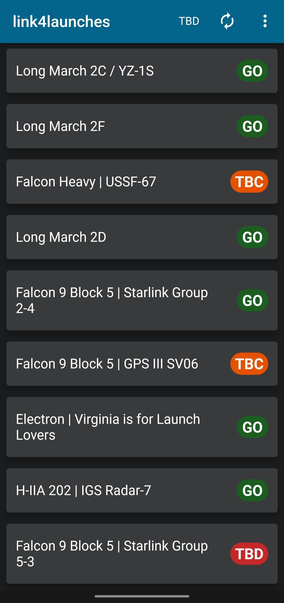
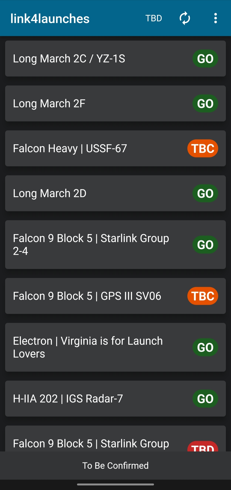
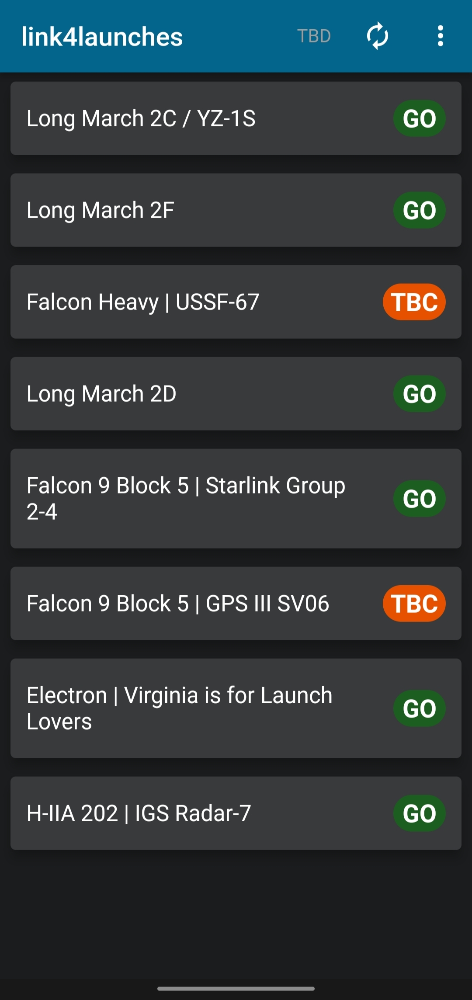
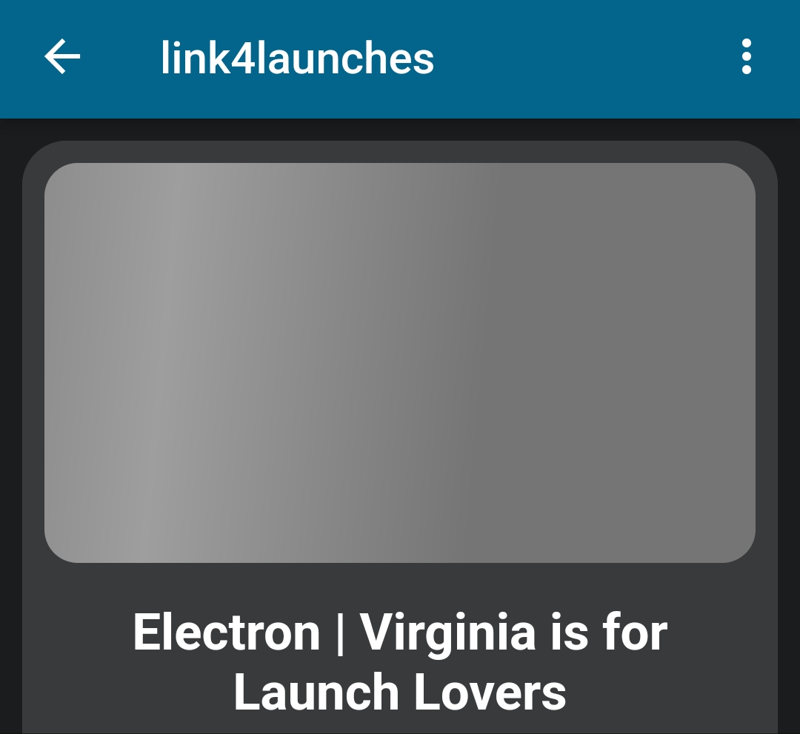
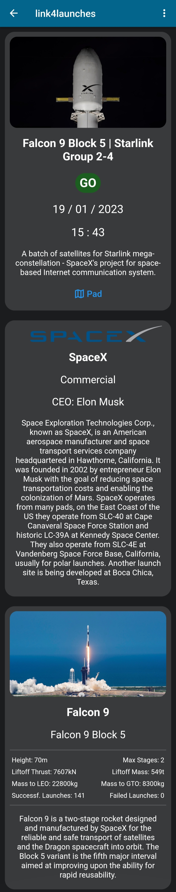
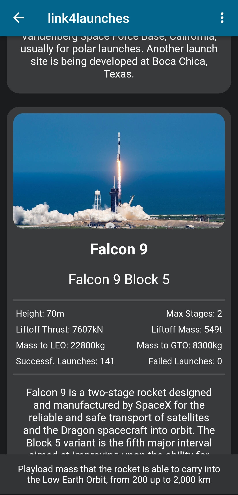

# link4launches
Rocket launches app inspired to [Link4Universe](https://www.adrianfartade.it), I mean, it's not rocket science.

## Idea
This project is inspired to the YouTube Channel [Link4Universe](https://www.youtube.com/@link4universe) which videos are about astronomy, rockets, launches, satellites, space exploration and many more... managed by [Adrian Fartade](https://www.adrianfartade.it/#chi-sono).

### Icon
The icon is inspired to the Telegram channel [L4U Space News](https://t.me/L4USpaceNews).

## API
The api used is [Launch Library 2](https://thespacedevs.com/llapi), developed by [Go4Liftoff](https://go4liftoff.com/about). The function used is **Launches**, which allows to get a json containing full info about launches from different companies. However the free use of the api is limited up to **15 uses per hour**, so it as the. That is why the app performs a main request for 14 upcoming launches and than for every launch performs another request for more specific info.
To avoid wasting requests, when the app is recharged or the reload button is pressed only the main request is performed, and the specific info data for every launch is then retrived from the backup file; if data regarding a specific launch aren't contained in the backup file a request is performed, but if two or more requests need data that were already requested (usually because there was another launch with the same info) the data are retrived from the previous request.

### Requests
The request vary based on many parameters, such as limit or the status (Ready To Go, To Be Confirmed...):
- The request used for upcoming launches list is the following, note that it also contains data about the latest performed launches: https://ll.thespacedevs.com/2.2.0/launch/upcoming/?format=json&limit=14
- The default request allows to get a 10 elements list: https://ll.thespacedevs.com/2.2.0/launch/upcoming/?format=json
- And this is the full link with all the parameters: [Full link](https://ll.thespacedevs.com/2.2.0/launch/upcoming/?agency_launch_attempt_count=&agency_launch_attempt_count__gt=&agency_launch_attempt_count__gte=&agency_launch_attempt_count__lt=&agency_launch_attempt_count__lte=&agency_launch_attempt_count_year=&agency_launch_attempt_count_year__gt=&agency_launch_attempt_count_year__gte=&agency_launch_attempt_count_year__lt=&agency_launch_attempt_count_year__lte=&format=json&location_launch_attempt_count=&location_launch_attempt_count__gt=&location_launch_attempt_count__gte=&location_launch_attempt_count__lt=&location_launch_attempt_count__lte=&location_launch_attempt_count_year=&location_launch_attempt_count_year__gt=&location_launch_attempt_count_year__gte=&location_launch_attempt_count_year__lt=&location_launch_attempt_count_year__lte=&mission__orbit__name=&mission__orbit__name__icontains=&name=&orbital_launch_attempt_count=&orbital_launch_attempt_count__gt=&orbital_launch_attempt_count__gte=&orbital_launch_attempt_count__lt=&orbital_launch_attempt_count__lte=&orbital_launch_attempt_count_year=&orbital_launch_attempt_count_year__gt=&orbital_launch_attempt_count_year__gte=&orbital_launch_attempt_count_year__lt=&orbital_launch_attempt_count_year__lte=&pad_launch_attempt_count=&pad_launch_attempt_count__gt=&pad_launch_attempt_count__gte=&pad_launch_attempt_count__lt=&pad_launch_attempt_count__lte=&pad_launch_attempt_count_year=&pad_launch_attempt_count_year__gt=&pad_launch_attempt_count_year__gte=&pad_launch_attempt_count_year__lt=&pad_launch_attempt_count_year__lte=&r_spacex_api_id=&rocket__configuration__full_name=&rocket__configuration__full_name__icontains=&rocket__configuration__id=&rocket__configuration__manufacturer__name=&rocket__configuration__manufacturer__name__icontains=&rocket__configuration__name=&rocket__spacecraftflight__spacecraft__id=&rocket__spacecraftflight__spacecraft__name=&rocket__spacecraftflight__spacecraft__name__icontains=&slug=&status=1)

## Interface and Functions

### Main page
The main page of the app is the following:

The list is made by the latest launches (like successful or failed launches [not in the image]) followed by all the upcoming launches order by launch date. The page can be scrolled to access the other launches, for a total number of 14. Every tile of the list contains both the name of the launch and his status that can be:
- **GO**: Ready To Go;
- **TBC**: To Be Confirmed;
- **TBD**: To Be Defined;
- **SUCCESS**: Launch Successful;
- **FAILURE**: Launch Failed;
- **IN FLIGHT**: Actually flying;
- **others**: Undefined.

By clicking on the status icon is possible to show a snackbar that will describe the state:

#### Appbar
The appbar contains the name of the app followed by 3 buttons:
- TBD: used to hide the To Be Defined result, as often there are many TBD launches which are less important than the others, as they still have to be defined.

- Recharge: used to send a request to the api and refresh data;
- Dropdown-menu: containg different links to:
    - The [API](https://thespacedevs.com/llapi);
    - The YouTube Channel [Link4Universe](https://www.youtube.com/@link4universe) which inspired the app;
    - My fancy github account :)

### Launch page
By clicking on a element the info page (launch page) is open and different containers are showed. Note that not every container may be displayed due to the request limit which blocked the request used to get the detail of the launch. If an element of the following isn't contained in the json than it's not displayed.
- The first container list launch data:
    - an image of the rocket or the payload, with a shimmering loading animation;

    

    
    

    - the full name of the launch;
    - the status (that can be clicked for description);
    - the launch date;
    - the launch time;
    - the description of the mission or the payload;
    - a button with a link to open the pad location on google maps.
- The second container list launcher agency data:
    - an image with the logo of the agency;
    - the name of the agency;
    - the pourpose of the launch;
    - the head of the agency;
    - the description of the agency.
- The third container list rocket configuration data:
    - the image of the rocket (if it is different from the one of the launch);
    - the name of the rocket;
    - the full name of the rocket (if it's different from the name of the rocket);
    - a details section which values are '---' if not present in the json and containing:
        - the height of the rocket in m;
        - the maximum number of stages the rocket can have;
        - the total thrust during the liftoff in kN;
        - the mass of the rocket during the liftoff in tonnes;
        - the playload mass that the rocket is able to carry into the Low Earth Orbit, from 200 up to 2,000 km
        - the playload mass that the rocket is able to carry into the Geostationary Transfer Orbit (35,786 km);
        - the number of successful launches;
        - the number of failed launches;
        
    - the description of the rocket.

#### Details
By clicking on a specific detail is possible to show a snackbar containing the description:

## Useful Links:
Some useful links:
 - The official web site of the api: [go4liftoff](https://thespacedevs.com/llapi)
 - Example of the api use made by api creators: [api.launches.example](https://go4liftoff.com/launches)
 - Link used in the application to get the main data: [api.launches.upcoming](https://ll.thespacedevs.com/2.2.0/launch/upcoming/?format=json&limit=14)
 - A web site to format the json: [json pretty print](https://jsonformatter.org/json-pretty-print)