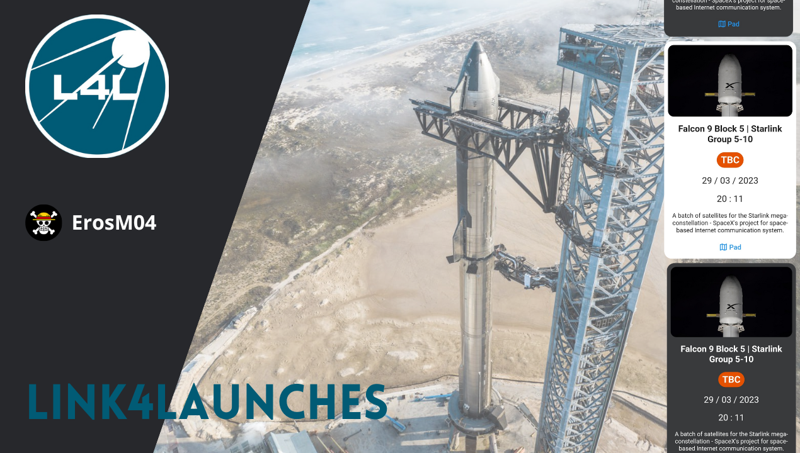

# Link4Launches
This mobile app📱 can be used to access information about upcoming rocket launches🚀 or latest launches performed by many different companies and agencies like **SpaceX**, **Rocket Lab**, **NASA**, **ESA**...

The app idea and style are both inspired to the YouTube channel [link4universe](https://www.youtube.com/@link4universe):star: managed by [Adrian Fartade](https://www.adrianfartade.it).

    

### Index

1. [Download and Installation](#download-and-installation)
2. [API](#api)
3. [Interface](#interface)
4. [Auto update](#auto-update)
5. [More info](#more-info)

## Download and Installation
To install the app, just download the apk file that you can find in the [latest release](https://api.github.com/repos/ErosM04/link4launches/releases/latest) or in the ``apk_release`` folder of this repository.
After you downloaded the file, on your Android smartphone just click on it and the installation process will start.

Don't worry if the system says that it's unsafe, that's because you are not downloading the app from the Play Store, trust me 😉.

## API
The api used to get the information is [Launch Library 2](https://thespacedevs.com/llapi), developed by [Go4Liftoff](https://go4liftoff.com/about). 
The api is used to obtain a json containing info about the upcoming **14** launches ([click to try](https://ll.thespacedevs.com/2.2.0/launch/upcoming/?format=json&limit=14)), plus other requests for the company/agency and rocket data.

As the free use of the api is limited up to **15 requests per hour** several mechanism to save requests are implemented. More info on the api and its use on [MORE_INFO.md](MORE_INFO.md).

## Interface
The app iterface is pretty simple, and only has two pages:

### Home page
The home page contains an appbar with different function and a list of launches tiles.

Every tile has a title (the name of the launch), the date on which the launch will take place and the status icon (like **GO**, **TBC**, **TBD**...), that can be clicked to obtain the description of the status.

Also using the Appbar buttons is possible to hide **TBD** launches, reload the data and open the pop-up menu. For more info go to [MORE_INFO.md](MORE_INFO.md).

    
    

### Launch page
By clicking on a tile in the home page is possible to access to the launch page, providing a lot of different information on the launch.

In this page there are 3 different information containers:
- **Launch Container** : contains information regarding the specific launch mission and the payload.
- **Agency/Company Container** : contains information regarding the government agency or the private company that hosts the launch.
- **Rocket Container** : contains information regarding the rocket used to transport the payload.

    
    

    
    

    
    

## Auto update
The app is able to auto-update itself thanks to the **GitHub API**.
Every time the app is loaded a request to the GitHub API is performed in order to get the latest version available. If the latest version is different from the actual one, a dialog appears and asks to the user if he/she wants to downalod the new version.

If the user gives his/her consent the download starts and the file ``link4launches.apk`` is downloaded and saved in the ``Downloads`` folder. Then just by clicking on it Android will automatically recognize it as an update.

    
    

## More Info
If you want to know more about the app features and how it works (e.g. api management) just take a look at [MORE_INFO.md](MORE_INFO.md).

If you have some suggestions or you found a bug create an [issue](https://github.com/ErosM04/link4launches/issues) to let me know ;).